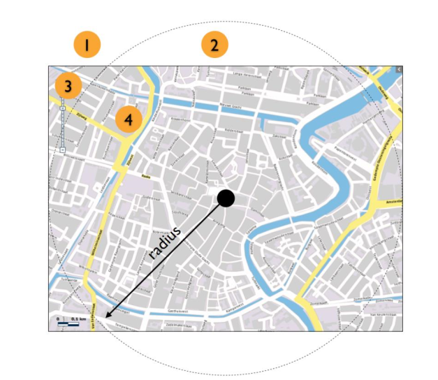
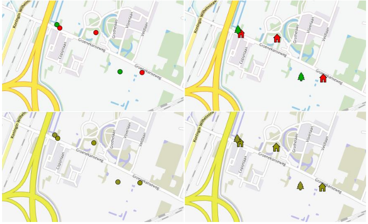
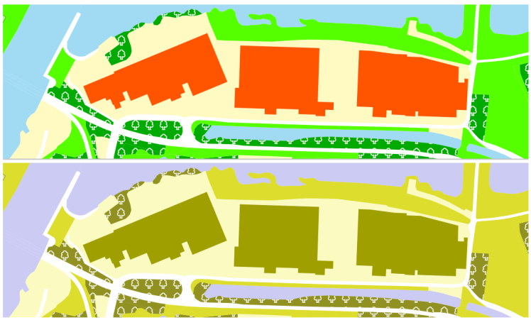

## De richtlijnen toegelicht voor geo
In dit hoofdstuk beschrijven we de belangrijkste eisen uit de webrichtlijnen en lichten die toe voor geo-informatie. We doen dit aan de hand van de structuur van de webrichtlijnen versie 2: we houden de volgorde aan van de principes universeel, waarneembaar, bedienbaar en begrijpelijk. Van elk principe komen de belangrijkste eisen aan bod. Per eis belichten we aandachtspunten, veelvoorkomende toegankelijkheidskwesties en suggesties voor oplossingen. Wilt u meer weten over de webrichtlijnen? Lees dan Hoofdstuk 5 Wat zijn webrichtlijnen?

De webrichtlijnen kennen verschillende niveaus van conformiteit. Voor alle eisen en indelingen in niveaus kunt u terecht in het meest recente normdocument (Webrichtlijnen versie 2 Normdocument, 2014). Wij raden u aan om minimaal aan niveau AA te voldoen. Maar voor geo-toepassingen is de extra moeite die u moet doen om niveau AAA te behalen, minimaal. We beschrijven de richtlijnen hieronder voor niveau A of AA. Waar niveau AAA relevant is, noemen we dat expliciet.

### Universeel
In deze paragraaf worden verschillende uitwerkingen van het principe universeel uitgelegd.

#### Gelaagd bouwen

> Gebruik technologieën op zodanige wijze, dat de basiscontent en -functionaliteit die nodig zijn om een webpagina te kunnen gebruiken onder alle omstandigheden beschikbaar zijn.
> _Webrichtlijn I - Richtlijn U.3.1 (Webrichtlijnen versie 2 Normdocument, 2014)_

Gelaagd bouwen betekent dat een website zodanig gelaagd is opgebouwd, dat iedereen gegarandeerd
toegang heeft tot de basisinhoud en -functionaliteit van de site, met welk type browser of internetverbinding
dan ook. Een gebruiker met een geavanceerde browser krijgt zo de optimale gebruikersbeleving, terwijl de
content en functionaliteit ook toegankelijk blijven voor een ‘eenvoudige’ gebruiker. Overigens heeft gelaagd
bouwen niet alleen voordelen voor gebruikers: voor zoekmachines biedt de basislaag de noodzakelijke
informatie om de content succesvol te kunnen indexeren.

##### Kwestie
Voor interactieve geografische webapplicaties kunnen browser plug-ins (zoals Macromedia Flash, Microsoft
Silverlight en Adobe Reader) nodig zijn om de informatie te benaderen. Het is verleidelijk om hierbij het
`<canvas>` element uit HTML5, WebGL of Scalable Vector Graphics (SVG) toe te passen. Maar lang niet
iedereen beschikt over de laatste browserversies die deze nieuwe webtechnologieën ondersteunen. Voor
interactieve kaartanimaties worden weer andere plug-ins gebruikt, zoals bijvoorbeeld QuickTime of MPEG.
Ook hier zijn SVG en WebGL open alternatieven, die echter niet door alle gangbare browserversies worden
ondersteund.

##### Mogelijke oplossing
In al deze gevallen kan gelaagd bouwen helpen. Een voorbeeld van gelaagd bouwen met geo-informatie en
kaarten is:
1. Zorg voor een duidelijke, tekstuele beschrijving van de informatie in de meest basale vorm.
1. Gebruik een niet-interactieve kaart waarop de informatie van 1 staat gepositioneerd, bijvoorbeeld met behulp van CSS.
1. Beschikt de gebruiker over technieken als JavaScript, en wilt u interactiviteit bieden? Gebruik dan JavaScript om de statische kaart van 2 te vervangen door een interactieve.

Een voorbeeld waarin gebruik wordt gemaakt van kaarten vindt u in [een weblog van Brad Frost](http://bradfrost.com/blog/post/adaptive-maps/) over gelaagd
bouwen (Adaptive Maps, 2012). In paragraaf 2.2.1 leest u meer over tekstalternatieven voor interactieve
kaarten, en in paragraaf 2.2.2 vindt u informatie over alternatieven voor kaartanimaties.

#### Foutmeldingen

> Zorg voor bruikbare foutmeldingen.
>
> _-Webrichtlijn II - Richtlijn U.4.1 (Webrichtlijnen versie 2 Normdocument, 2014)_

> `(gui.layers.TilingLayer):Can't find the parent Map component.`
>
> Voorbeeld Foutmelding gepresenteerd aan eindgebruiker door een geo-viewer

Het geven van bruikbare foutmeldingen is niet specifiek voor geo-informatie. Toch is dit ook belangrijk voor
toepassingen die met geo-informatie werken. Denk bijvoorbeeld bij het zoeken van locaties via een formulier
aan het geven van suggesties bij spelfouten (Bedoelde u...?), in plaats van het weergeven van ‘Geen
resultaten’.

Ook het afvangen en omzetten van foutmeldingen van eventuele (externe) webservices is zinvol. Dan
begrijpt de gebruiker wat er aan de hand is. Meer tips over foutmeldingen vindt u op de [pagina over
contingency design](http://www.webrichtlijnen.nl/aan-de-slag/contingency-design) op webrichtlijnen.nl (Webrichtlijnen.nl, 2014).

#### Invoer: formulier om locatie in te tekenen

> Maak formulieren optimaal bruikbaar.
>
> Webrichtlijn III - Richtlijn U.5.1 (Webrichtlijnen versie 2 Normdocument, 2014)

Voor het zoeken van locaties op adres of plaatsnaam wordt vaak een formulier gebruikt. Daarbij is het
belangrijk om de gebruiker goed naar het gewenste resultaat te begeleiden. Denk bijvoorbeeld aan het
suggereren van andere schrijfwijzen van een plaatsnaam. Of het opnemen van de provincienaam bij een
plaatsnaam, zodat de gebruiker de juiste plaats kan kiezen.

##### Kwestie

Een gebruiker kan een locatie niet altijd tekstueel aanduiden. Bijvoorbeeld bij een plek ergens op straat,
midden in een weiland of op het water. Voor een Melding Openbare Ruimte (MOR) wordt regelmatig gevraagd
om de locatie van de melding aan te geven, en voor bepaalde vergunningaanvragen (bijvoorbeeld een
Watervergunning) is een coördinatenpaar essentieel. Hoe zou de invoer van de locatie dan kunnen, op een
toegankelijke manier?

##### Mogelijke oplossingen

Het is lastig om dit generiek aan te geven. Oplossingen kunnen liggen in gebruik van extra tooling, zoals de
JavaScript Geolocation API in HTML5. Een gebruiker met een apparaat dat GPS ondersteunt, kan hiermee
op de plek zelf een locatie automatisch invoeren. Of de gebruiker voert de locatie bij benadering in: via een
adres met een tekstuele beschrijving (of een straal en/of kaart) om de locatie te corrigeren. Deze manier
van invoeren vraagt iets meer verwerking om tot een exacte locatie te komen. Toch kan het soms nuttig
zijn om het op deze manier te doen.

Probeer in ieder geval te voorkomen dat locaties of gebieden opnieuw gedigitaliseerd worden. Achterhaal
liever de gewenste geometrie uit bestaande registraties door administratieve eigenschappen (zoals adres en
eigenaar) te koppelen. In plaats van het intekenen van een perceel om te bepalen of dit in een
vogelrichtlijngebied ligt, kan de gebruiker ook een perceelnummer invoeren. Daarna kan het systeem de
geometrie van zijn perceel uit de Basisregistratie Kadaster (BRK) ophalen, en de geometrie van het
vogelrichtlijngebied uit Natura 2000. De webapplicatie doet zelf de geografische analyse van de twee
geometrieën, en stelt daarmee de overlap vast. Op deze manier kunt u de vraag van de gebruiker vrij simpel
beantwoorden.

In paragraaf 2.4.2 leest u meer over het bieden van hulp bij het invullen van formulieren om fouten te
vermijden.

#### iFrames en kaarten

> Sluit niemand uit bij het aanbieden van content middels geneste weergavekaders.
>
> Webrichtlijn IV - Richtlijn U.7.1 (Webrichtlijnen versie 2 Normdocument, 2014)

Geografische webapplicaties worden vaak als zelfstandige applicaties ontwikkeld, met eigen tooling en los
van bestaande Content Management Systemen (CMS). Met als gevolg dat een iFrame nodig is om de
geografische webapplicatie ‘in te lezen’ in het CMS. Met zo’n iFrame reserveert het CMS een vaste plek op
de pagina voor invulling door de geografische webapplicatie. De eindgebruiker merkt hier vrijwel niets van.

> Een voorbeeld hiervan is de Geluidskaart van de gemeente Nieuwegein (Geluidskaart Nieuwegein, 2014). Deze pagina roept met een iFrame de geografische webapplicatie aan van een andere URL. (GeoServer nieuwegein, 2014)

> Ook [PDOK Kaart](http://kaart.pdok.nl/) (PDOK Kaart, 2014) kan met de optie “Als URL” via een iFrame worden aangeroepen vanuit een CMS.

##### Kwestie
Over het algemeen raden wij iFrames af. Gebruikers kunnen namelijk vast komen te zitten via een iFrame,
of ze kunnen informatie niet in de juiste context vinden. (Om dit te omzeilen kunt u een link aanbieden
buiten het iFrame, waarmee de gebruiker de geo-applicatie ook als aparte pagina kan laden. Maar dit is een
noodscenario.)

##### Mogelijke oplossingen
Er zijn ook andere manieren om geo-applicaties in te passen. Online kaartplatformen bieden vaak de
mogelijkheid om via script kaarten in te bouwen in uw eigen systeem. Dat gaat bijvoorbeeld via Map API's
(Javascript-bibliotheken). Of u kunt op het kaartplatform een stukje HTML-code genereren, dat u eenvoudig
kopieert naar uw eigen systeem (zoals bij Google Maps en PDOK Kaart). Als u via script rechtstreeks een
kaart inbouwt, hebt u bovendien de mogelijkheid om nog eigen wensen door te voeren: u kunt dan
bijvoorbeeld bepalen hoe groot het zoomniveau is, of welke kaartlagen de applicatie laat zien.

#### Openheid, open specificaties

> Gebruik bij het aanbieden van content ten minste open, niet leverancier afhankelijke en voor webcontent bedoelde specificaties. En geef bij gelijke geschiktheid de voorkeur aan open standaarden.
>
> Webrichtlijn V - Richtlijn U.9.1 (Webrichtlijnen versie 2 Normdocument, 2014)

Gebruikt u WebGIS-frameworks of JavaScript-bibliotheken om interactieve kaartapplicaties te publiceren?
Dan is het goed om te weten dat die veel HTML-, CSS- en JavaScript-code bevatten en/of automatisch
genereren.

##### Kwestie
Het komt geregeld voor, dat deze code niet volledig voldoet aan webstandaarden. Daardoor is uw website
niet optimaal toegankelijk.

##### Mogelijke oplossing
Het is verstandig om uw website hierop te toetsen, bijvoorbeeld met online validators. In Bijlage 3 vindt u
een aantal aanbevolen validators.

#### Toegankelijke URI's

> URI's dienen duidelijk, uniek en duurzaam te zijn.
>
> Webrichtlijn VI - Richtlijn U.10 (Webrichtlijnen versie 2 Normdocument, 2014)

Is mogelijk om elke plek op een kaart met een unieke en leesbare URI te bereiken? Volgens de webrichtlijnen
moet het adres van een webpagina duidelijk, uniek en duurzaam zijn. De URI van een webpagina is in de
praktijk een URL. Technisch gezien zijn URL’s en URI’s echter niet exact hetzelfde. Deze [website over URI’s](http://nl.wikipedia.org/wiki/Uniform_Resource_Identifier) geeft hier meer informatie over (Uniform Resource Identifier, Wikipedia, 2014).

##### Kwestie
Duurzaam en uniek (niveau AAA) is geen probleem: een plek op een kaart is namelijk statisch. Over een
jaar verwijst een set coördinaten nog steeds naar dezelfde plek. Het eerste criterium, duidelijkheid, is iets
ingewikkelder.

##### Mogelijke oplossingen
Er zijn methodes om URI’s duidelijk te houden. Een gebruiker navigeert naar een adres dat bijvoorbeeld als
volgt is opgebouwd: `/den-haag/wilhelmina-van-pruisenweg/noord-133m/west-5m`. De URI toont zo niet
alleen de exacte locatie, maar ook de context van waaruit de gebruiker werkt. Dit zorgt voor duidelijkheid.

Daarnaast: niet elke positie op een kaart hoeft bereikbaar te zijn. De kaart is een middel waarmee u
informatie ontsluit. Het is deze informatie die bereikbaar moet zijn via URI's. Dat kunnen vlakken zijn
(gebieden als een veiligheidsregio of gemeente), lijnen (zoals routes) of punten (een exacte locatie): die
moeten afzonderlijk herkenbaar zijn. De onderliggende punten op de kaart zijn decoratief of geven context,
en zijn geen primaire inhoud. Over primaire informatie leest u meer in paragraaf 2.2.1.

### Waarneembaar
In deze paragraaf worden verschillende uitwerkingen van het principe waarneembaar uitgelegd.

#### Tekstalternatieven

> Lever tekstalternatieven voor alle niet-tekstuele content”, behalve voor (o.a.) zintuiglijke of decoratieve content of “slechts voor visuele opmaak wordt gebruikt.
>
> _Webrichtlijn VII - Richtlijn 1.1 (Webrichtlijnen versie 2 Normdocument, 2014)_

Geografische webapplicaties zijn een middel om locatiegebonden informatie te publiceren. Met een kaart
toont u informatie op een bepaalde locatie. Toegankelijkheid gaat erom, dat die informatie bereikbaar is
voor de gebruiker.

##### Kwestie
Veel locatiegebonden informatie wordt alleen in een afbeelding (een kaartlaag) gepresenteerd. Maar de
boodschap van de informatie moet ook tekstueel beschikbaar te zijn, al dan niet via een zoekingang of
filtermogelijkheid.

##### Mogelijke oplossingen
U kunt dit bijvoorbeeld doen in een statische lijst, of door middel van een formulier dat op te vragen is als
tekst. Hier zijn verschillende oplossingen voor. Welke oplossing u kiest, hangt onder meer af van het soort
informatie en de toepassing. In deze sub paragraaf worden de verschillende oplossingen aangeboden om
tot een tekst alternatief te komen. In Hoofdstuk 3 wordt dieper ingegaan op het bieden van een
tekstalternatief door een andere aanpak voor te stellen, waarbij de gebruikersvraag centraal staat.

##### Wat is de primaire informatie?
Bedenk wat de primaire informatie is, die u wilt overdragen. En presenteer die informatie ook als tekst. U
hoeft namelijk niet alle beschikbare informatie in de geo-applicatie toegankelijk te maken. Bepaalde
secundaire informatie (die wel visueel op de kaart aanwezig is) hoeft niet voor iedereen op elk apparaat
zichtbaar te zijn. Voor de optocht van Sinterklaas zijn bijvoorbeeld alleen de locatie van het officiële onthaal
en de straten van de aansluitende optocht de primaire informatie.

Een groot voordeel van een geografische webapplicatie is dat een gebruiker er zelf aanvullende informatie
uit af kan leiden. Bij de Sinterklaasoptocht kan hij bijvoorbeeld meteen zien waar de dichtstbijzijnde OV-
halte of parkeergelegenheid is.

Presenteert u deze aanvullende (en dus secundaire) informatie als primaire informatie? Dan moet u die ook
toegankelijk (bijvoorbeeld in tekst) aanbieden. Doet u dat niet, dan is deze afgeleide informatie ‘decoratief’.

##### Wat de kaart toont is niet altijd logisch
Een kaart op internet laat niet altijd het meest intuïtieve stukje van de omgeving zien. De gebruiker navigeert
altijd vanuit een bepaalde locatie (bijvoorbeeld het thuisadres). Alle apparaten die hij daarvoor kan
gebruiken, hebben een rechthoekig scherm. Daardoor kan het gebeuren dat elementen die dichtbij zijn, niet
op de kaart getoond worden. En dat elementen die verder weg zijn, wel zichtbaar zijn. In Figuur 1 ziet u
hier een voorbeeld van.

Punt 2 is dichterbij dan punt 3, maar wordt niet getoond op een normaal scherm

Bij het maken van een tekstuele variant van een visuele kaart is het goed om hier rekening mee te houden.
Leg dus niet uit wat er op de rechthoekige kaart staat, maar geef de informatie logisch weer, geredeneerd
vanuit de cirkelvormige straal. Dat kan betekenen dat een tekstuele beschrijving andere resultaten geeft
dan de visuele variant.

> Een *rond* radarscherm is het beste om vanuit een locatie te denken.
> Voorbeeld - Radar

> Bij GEOZET wordt de functionaliteit in twee lagen aangeboden: een core en enhanced versie. De core is een formulier waarin locatie gevraagd wordt, met zoekresultaten gesorteerd op afstand. Hoe dichterbij het zoekresultaat, hoe hoger het in de lijst staat. De enhanced versie is een volledig interactieve kaart. De functionaliteiten zijn niet hetzelfde, zo kun je in de core zoomen terwijl in de enhanced versie er een straal opgegeven kan worden. Het effect is gelijkwaardig, maar de uitvraag aan de gebruiker verschilt
>
> Geaccepteerde uitgangspunten van GEOZET:
> * Er kan een gering onderscheid zijn tussen de zoekresultaten die – bij opgave van eenzelfde adres - getoond worden in de core-versie en in de enhanced-versie.
> * Bepaalde secundaire informatie, die niet direct bijdraagt aan het beantwoorden van de geformuleerde zoekvraag, kan worden getoond in de enhanced-versie en niet in de core-versie.
> * De enhanced-versie kan secundaire informatie bevatten die niet volledig voldoet aan de webrichtlijnen en de toegankelijkheidsrichtlijnen.
>
> Voorbeeld - Geozet

#### Op tijd gebaseerde media

> Lever alternatieven voor op tijd gebaseerde media
>
> Webrichtlijn VIII - Richtlijn 1.2 (Webrichtlijnen versie 2 Normdocument, 2014)

Wanneer de webrichtlijnen spreken over tijd gebaseerde media, dan gaat het meestal over online
gepubliceerd videomateriaal. In de context van geo-informatie zijn de webrichtlijnen met betrekking tot tijd
gebaseerde media vooral van belang voor kaartanimaties. Kaartanimaties zijn meestal zonder geluid. In
veel gevallen zijn het ‘vooraf opgenomen’ animaties, zoals de geografische verspreiding van een
griepepidemie door de tijd. Een voorbeeld van een ‘live’ kaartanimatie is weerinformatie, waarbij gebruikers
kunnen zien of er buien aankomen.

Een tekstuele transcriptie van een kaartanimatie geeft, in correcte volgorde, tekstbeschrijvingen van de
visuele informatie. Het is een beproefd en effectief middel om welke kaartanimatie dan ook optimaal
toegankelijk te maken.

#### Onderscheidbaar

> Kleur wordt niet als het enige visuele middel gebruikt om informatie over te brengen, een actie aan te geven, tot een reactie op te roepen of een visueel element te onderscheiden.
>
> Webrichtlijn IX - Richtlijn 1.4.1 (Webrichtlijnen versie 2 Normdocument, 2014)

Maak het voor gebruikers gemakkelijker om voorgrondinformatie te scheiden van de achtergrond.
Presenteert u visuele informatie boven op een achtergrond? Zorg er dan voor dat die informatie dan
voldoende met de achtergrond contrasteert.

##### Kwestie
Veel kaarten gebruiken kleuren om primaire informatie weer te geven. Maar alleen kleur is niet toegankelijk
genoeg. Een gebruiker die kleurenblind is, kan hier namelijk niet mee uit de voeten.

##### Mogelijke oplossingen

Gebruik naast kleur ook vorm. Bijvoorbeeld bij symbolen op een kaart. Zorg, in plaats van alleen rode en
groene cirkels, ook voor een andere vorm: gebruik rode cirkels en groene vierkantjes. Zorg ervoor dat de
belangrijkste informatie (dus de informatie die door de kaart ontsloten wordt, en niet de kaart zelf) goed
leesbaar is qua contrast.

> De visuele weergave van tekst en afbeeldingen van tekst heeft een contrastverhouding van ten
> minste 4,5:1”, behalve als: ”Tekst of afbeeldingen van tekst die deel zijn van een inactieve
> component van de gebruikersinterface, die puur decoratief zijn, die voor niemand zichtbaar zijn, of
> die onderdeel zijn van een afbeelding die significant andere visuele content bevat, hebben geen
> contrasteis.
>
> Webrichtlijn X - Richtlijn 1.4.3 (Webrichtlijnen versie 2 Normdocument, 2014)

De eis over kleurcontrast gaat over de primaire content. Voor een achtergrondkaart heeft de contrast-eis
vrijwel geen gevolgen. De meeste kaartachtergronden hebben tussen bijvoorbeeld straatnamen en
straatondergrond al genoeg contrast. Tussen kleurvlakken onderling geldt geen eis.

Figuur – Punten, Vorm, Kleur, Gebruik

Onderscheid maken met alleen kleur, kan zorgen voor problemen bij kleurenblindheid. De voorbeelden in
Figuur 2 laten zien dat het gebruik van vorm (in aanvulling op kleur) kan helpen. Het onderscheid in
categorieën is in deze voorbeelden te maken via kleur en vorm. Links toont wat iemand ziet als alleen kleur
gebruikt wordt voor het onderscheid, rechts als ook vorm gebruikt wordt. De bovenste afbeeldingen zijn de
normale kleurweergaves, de onderste simuleren een bepaald soort kleurenblindheid (zogenaamde
Deuteranopia). De iconen die kleur en vorm gebruiken zijn ook met kleurenblindheid te onderscheiden. Voor
vlak-informatie kan in plaats van alleen kleur ook met arcering en/of symbolen gewerkt worden.

Kleur en vorm voor vlak-informatie

De bovenste helft toont onderscheid door kleur en vorm voor vlak-informatie. In de onderste helft is een
bepaald soort kleurenblindheid (zogenaamde Deuteranopia) gesimuleerd. Het onderscheid in kleur is bijna
weggevallen, maar door ook vorm te gebruiken is wel degelijk onderscheid te maken.

### Bedienbaar

In deze paragraaf worden verschillende uitwerkingen van het principe bedienbaar uitgelegd.

#### Toetsenbordbediening

> _Nota bene oorspronkelijke eis mist in document_
>
> Webrichtlijn XI - Richtlijn 2.1 (Webrichtlijnen versie 2 Normdocument, 2014)

De muis is een vanzelfsprekend middel voor de bediening van kaartfunctionaliteit. Maar niet iedereen kan
op elk apparaat gebruikmaken van een muis. Voor een goede toegankelijkheid van een website is volledige
toetsenbordbediening essentieel. Daarom vraagt dit onderwerp om extra aandacht.

##### Kwestie
Vaak biedt een website functionaliteit (knoppen), waarmee de gebruiker de applicatie kan besturen en
gegevens kan opvragen. Helaas is deze functionaliteit vaak niet (of niet volledig) te bedienen met het
toetsenbord.

> De [Risicokaart](http://nederland.risicokaart.nl/risicokaart.html) is een voorbeeld van een kaart die helemaal niet te bedienen is met het toetsenbord
> (Risicokaart van Nederland, 2014)
>
> Voorbeeld - Risicokaart

> [Ruimtelijke Plannen](https://www.ruimtelijkeplannen.nl/viewer/) is een voorbeeld van een webapplicatie waarvan de het formulier en kaart maar beperkt te bedienen zijn met het toetsenbord (Webapplicatie van ruimtelijke plannen, 2014).

##### Mogelijke oplossingen
Met het toetsenbord moet de gebruiker zowel door de kaart zelf als door alle informatie-elementen kunnen
navigeren. Dus als er informatie in pop-ups staat, dan moeten die pop-ups te openen zijn via het
toetsenbord.

Dat kan via voorgeprogrammeerde access keys: bijvoorbeeld de pijltjestoetsen om de kaart te bewegen, of
de plus- en min-toetsen voor in- en uitzoomen. De navigatietools die vaak linksboven in de kaart staan om
de kaart te verplaatsen en in te zoomen, kunt u hiermee ook bereikbaar maken. Een voorbeeld hiervan is
de kaart Bekendmakingen op Overheid.nl (zie ).

De mogelijkheid van access keys hoeft u overigens niet altijd zelf te implementeren: soms maakt deze
functionaliteit standaard deel uit van softwarebibliotheken.

Besteed dus aandacht aan toetsenbordbediening, ook bij het testen. Laat overbodige functionaliteit weg;
dat scheelt ook werk met het toegankelijk maken.

> De bibliotheken OpenLayers en LeafletJS bieden navigatie via het toetsenbord. Echter, het bekijken van gegevens op een kaart, bijvoorbeeld via informatie-ballonnen, is vaak lastig met alleen het toetsenbord. Ondersteuning hiervoor is slechts in enkele gevallen aanwezig. Bij de keuze voor een toolbox en bij het realiseren verdient toetsenbordbediening daarom extra aandacht.
>
> Voorbeeld - Navigatie via het toetsenbord

#### Genoeg tijd

> Geef gebruikers genoeg tijd om content te lezen en te gebruiken.
>
> Webrichtlijn XII - Richtlijn 2.2 (Webrichtlijnen versie 2 Normdocument, 2014)

Bij kaartanimaties is het belangrijk, dat de gebruiker de timing kan aanpassen en de animatie kan pauzeren,
stoppen en verbergen. In paragraaf 2.2.2 leest u meer over kaartanimaties.

#### Toevallen

> Ontwerp content niet op een manier waarvan bekend is dat die toevallen veroorzaakt.
>
> Webrichtlijn XIII - Richtlijn 2.3 (Webrichtlijnen versie 2 Normdocument, 2014)

Zorg bij het automatisch afspelen van kaartanimaties ervoor, dat vlakken niet sneller veranderen dan 3 keer
per seconde. Animeer kleine geografische eenheden en gebruik andere signaalkleuren dan de kleur rood.
Accessibility besteedt op haar [website](https://www.accessibility.nl/kennisbank/webrichtlijnen2#algemene-flits-en-rodeflitsdrempelwaarden) aandacht aan algemene flits en rodeflitsdrempelwaarden
(Webrichtlijnen 2 - Principes, richtlijnen en succescriteria (www.accessibility.nl), 2014). Over kaartanimaties
staat meer informatie in paragraaf 2.2.2.

### Begrijpelijk
In deze paragraaf worden verschillende uitwerkingen van het principe universeel uitgelegd.

#### Leesbaarheid en leesniveau

> Maak tekstcontent leesbaar en begrijpelijk.
>
> Webrichtlijn XIV - Richtlijn 3.1 (Webrichtlijnen versie 2 Normdocument, 2014)

> Als tekst, nadat eigennamen en titels verwijderd zijn, een leesvaardigheid vereist die hoger is dan het niveau van drie jaar middelbaar onderwijs, dan is aanvullende content beschikbaar, of er is een versie beschikbaar die geen leesvaardigheid vereist die hoger is dan van drie jaar middelbaar onderwijs.
>
> Webrichtlijn XV - Richtlijn 3.1.5 (Webrichtlijnen versie 2 Normdocument, 2014)

##### Kwestie
Soms staat in deze ballonnen per ongeluk nog technische informatie, zoals identifiers, codes of afkortingen.
Maar het kunnen ook (interne) beschrijvingen zijn, die niet begrijpelijk of relevant zijn voor de algemene
gebruiker.

##### Mogelijke oplossing
Verwijder overbodige informatie als technische details of beschrijvingen voor intern gebruik. Besteed hier
aandacht aan.

#### Assistentie bij invoer
> Help gebruikers om fouten te vermijden en ze te verbeteren
>
> Webrichtlijn XVI - Richtlijn 3.3 (Webrichtlijnen versie 2 Normdocument, 2014)

Vraagt u een gebruiker om een adres in te voeren? Voorkom dan dat een onjuiste combinatie (van
bijvoorbeeld straatnaam, woonplaats en postcode) een foutmelding oplevert. Als een woonplaats in
meerdere gemeenten valt, dan kan de webapplicatie de gemeentenaam of provincienaam suggereren. Dit
helpt de gebruiker om de juiste woonplaats te identificeren. Zie ook paragraaf 2.1.3.

> Als een invoerfout automatisch ontdekt wordt en suggesties voor verbetering bekend zijn, dan worden de suggesties aan de gebruiker geleverd, tenzij dit de beveiliging of het doel van de content in gevaar zou brengen.
>
> Webrichtlijn XVII - Richtlijn 3.3.3 (Webrichtlijnen versie 2 Normdocument, 2014)
