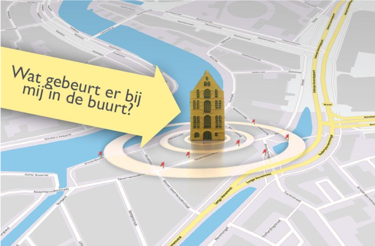
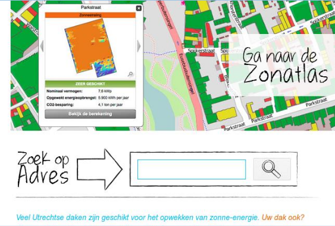

## De gebruikersvraag centraal

Suggesties voor een andere aanpak bij het ontsluiten van locatiegebonden informatie.

Locatiegebonden informatie toegankelijk maken voor iedereen kan een lastige opgave zijn. Een
hele werkbare aanpak is de vraaggerichte aanpak: stel de gebruikersvraag centraal, probeer die
eerst tekstueel / in woorden te beantwoorden en beslis daarna pas welk middel het meest geschikt is om de
gevraagde informatie te presenteren. Beperk de informatie en functionaliteit tot wat nodig is om
de vraag te beantwoorden.

Welke functionaliteit u het beste kunt gebruiken hangt af van veel factoren, zoals het doel van de toepassing,
de te beantwoorden vragen, de complexiteit, de benodigde (en beschikbare) gegevens en de gewenste
presentatievorm en mate van interactiviteit. Daarnaast spelen factoren als budget, tijd en capaciteit
uiteraard ook een rol.

> I suppose it is tempting, if the only tool you have is a hammer, to treat everything as if it were a nail.
>
> _- Abraham Maslow_

### Het aanbod centraal
Een geografische webapplicatie met een interactieve kaart is voor veel overheidsorganisaties dé manier om
locatiedata online te publiceren. De kaart vormt een visueel aantrekkelijke manier om veel gegevens
aan te bieden. Deze geografische webapplicaties bieden gebruikers bovendien veel mogelijkheden om de
kaart aan te passen. De rijkdom aan functionaliteit maakt het lastig en kostbaar om de informatie toegankelijk te ontsluiten. Hierdoor ontstaat het beeld dat geo-informatie en toegankelijkheid botsen.

> Waarom zou een gebruiker geïnteresseerd zijn in een kaart met allerlei datasets door elkaar heen? De praktijk toont aan dat specifieke themakaarten meer bezoekers krijgen dan kaartportals. Hoewel al enkele jaren oud, is het volgende voorbeeld nog steeds actueel. Het beschrijft hoe in Denver thematische kaarten drie keer meer bezocht worden dan portals (bron: [How the Public Actually Uses Local Government Web Maps: Metrics from Denver, 2012](http://mapbrief.com/2012/08/01/how-the-public-actually-uses-local-government-web-maps-metrics-from-denver/)). De meeste bezoekers blijven kort op de website en willen slechts antwoord op hun ene vraag en verdwijnen weer van de pagina.
>
> [Why Map Portals Don’t Work, 2013](http://mapbrief.com/2013/02/05/why-map-portals-dont-work-part-i/).

Deze aanbodgerichte aanpak is begrijpelijk. Het sluit aan bij de gangbare en beschikbare middelen om geo-
informatie online te publiceren. Door alle gegevens in één keer op een kaart af te beelden, denkt de
organisatie wellicht, dat zij daarmee aan bepaalde wettelijke eisen of transparantie doelstellingen voldoet.
De gebruikers kunnen immers bij de gegevens: zij kunnen uitzoeken wat zij nodig hebben.

Op deze manier publiceer je een soort ‘digitale atlas’. De (onbewuste) verwachting daarbij is dat gebruikers deze rustig
doorbladeren, op zoek naar dat ene gegeven. Zo wordt het web niet primair gebruikt: zo'n geografische
webapplicatie sluit niet aan bij de diversiteit van gebruikers en middelen. Denk alleen al aan alle mogelijke
apparaten en momenten waarop gebruikers informatie online opzoeken. Wie kan bijvoorbeeld op zijn
mobiele telefoon zo'n applicatie snel en volledig laden, laat staan gebruiken? Heeft iedereen altijd wel een
muis tot zijn beschikking? Dit zijn allemaal kwesties op het gebied van toegankelijkheid. Ten slotte rijst de
vraag, hoeveel van deze geografische informatie daadwerkelijk wordt geraadpleegd en gebruikt.

> De beste manier om een boom te verstoppen, is in het bos.
>
> _-Jan Terlouw_

### De vraag centraal

Tegenover de aanbodgerichte aanpak die we hierboven beschreven, staat de vraaggerichte aanpak. Waarom
willen gebruikers bepaalde digitale dienstverlening of informatie op het web eigenlijk gebruiken? Met welke
vraag komen zij naar de website? Welk antwoord moet je daarop geven? En: is dat ook het antwoord waar
die gebruiker op zat te wachten?

Gebruikers komen naar een website voor een bepaalde taak: om informatie op te vragen of een aanvraag
te doen. Om de gebruiker te helpen, bieden overheden op hun websites gegevens en functionaliteit aan. In
een - voor de gebruiker - ideale situatie zijn die gegevens zo bewerkt, dat ze naadloos aansluiten bij zijn
behoefte. Zodat hij zo snel mogelijk het juiste antwoord heeft op zijn vraag. Dat is een vraaggerichte
ontsluiting: het zo simpel en direct mogelijk geven van het juiste antwoord op de vraag van de gebruiker.
Niet meer en niet minder!

Het is belangrijk om de top-5 taken waarom gebruikers een website bezoeken te bepalen, aldus de “Long
Neck”-theorie van Gerry McGovern. Deze 5 taken staan voor 25 procent van de aandacht en
klanttevredenheid. Door de website te richten op deze zogenaamde top-taken krijg je een meer klantgerichte
website en creëer je een positieve gebruikerservaring.

Geo-informatie moet gebruik maken van deze wetenschap en aansluiten bij de gebruikersvraag. In veel
gevallen is een atlas niet de echte gebruikersvraag. Veel vragen over locatiegebonden informatie gaan over
de locatie van de gebruiker. In het algemeen is het huisadres van een burger of het vestigingsadres van een
bedrijf dus een goed startpunt en handige (zoek)ingang. Daarbij is het in de meeste gevallen handig om
naar één thema tegelijk te kijken. De volgende voorbeelden illustreren dit.

Figuur – Veelvoorkomende gebruikersvraag: wat gebeurt er bij mij in de buurt?

> Voorbeeld: Berichten over uw buurt (overheid.nl)
>
> Vraag: Welke besluiten van (lokale) overheden, zoals vergunningen, bouwplannen en lokale regelgeving, zijn recentelijk in de buurt van een locatie gepubliceerd. [https://www.overheid.nl/berichten-over-uw-buurt](https://www.overheid.nl/berichten-over-uw-buurt)
> Antwoord: de besluiten in de buurt van het opgegeven adres, gesorteerd op datum en nog na te filteren. In lijst beschikbaar en via een kaart.

> Voorbeeld - Bestemmingsplannen
>
> Bestemmingsplannen worden gepubliceerd, zodat een gebruiker kan zien wat wel en wat niet mag
> op plekken die hij/zij interessant vindt. Kijkend naar de belevingswereld van de gebruiker, is de
> vraag waarschijnlijk alleen niet om alle bestemmingsplannen in zijn/haar gemeente of buurt te
> kunnen zien op een kaart (wat het antwoord van de aanbieder lijkt te zijn), maar veel specifieker:
> wat mag ik wel/niet doen bij mijn huis (of op locatie X)? Of: mag ik hier mijn bedrijf uitbouwen?

> Voorbeeld - Afvalinzameling
>
> Vraag: Waar zijn de glasbakken bij mij in de buurt te vinden?
> Antwoord: Een lijst met dichtstbijzijnde glasbakken en de straatnaam erbij (“straat X, bij Winkelcentrum Y”)

> Voorbeeld - Vergunningsaanvragen
>
> Vraag: Welke aanvragen zijn bij mij in de buurt gedaan? (En zal ik daar hinder van ondervinden?)
> Antwoord: Een lijst met aanvragen in de buurt van het opgegeven adres, gesorteerd op afstand van het opgegeven adres. GEOZET beantwoordt de vraag: “Welke lokale bekendmakingen zijn er recent bij mij in de buurt gedaan?”

> Voorbeeld - Zonne-energie
>
> Vragen: Wat zou ik kunnen besparen met zonne-energie? Is mijn dak geschikt voor zonne-energie?
> Antwoord: Een simpel ja of nee of “zeer geschikt” tot “niet geschikt”. Eventueel met een indicatie van de te verwachten opbrengst.
>
> 
> Figuur – Zonatlas
>
> De Zonatlas gebruikt als zoekingang een adres, daarna verschijnt de rest, met een antwoord in hoeverre een dak geschikt is voor zonne-energie. Zie bijvoorbeeld [www.zonatlas.nl/amsterdam/](https://www.zonatlas.nl/amsterdam/). Dit is een voorbeeld van een vraaggerichte benadering, ondersteund door geo-informatie.

> Voorbeeld - Luchtkwaliteit
>
> Vragen: Is de lucht bij mij thuis schoon? (“Zijn we veilig?”) Hoe verhoudt zicht dat tot de omgeving, landelijk, ...?
>
> Antwoord: Een simpele classificatie: vervuild, schoon, boven/onder gemiddeld.

> Voorbeeld - Handelsmissies
>
> Vragen: Vragen: Waar gaan de volgende handelsmissies van de Minister van Buitenlandse zaken heen? Wanneer is de volgende handelsmissie naar Land X?
>
> Antwoord: Een alfabetische lijst met bestemmingen.

De antwoorden bij alle bovenstaande voorbeelden zijn uitstekend tekstueel te geven. Deze antwoorden zijn
goed toegankelijk in een kaart te presenteren als ondersteuning bij de tekst. Deze kaarten vereisen weinig
functionaliteit of visualisatie. Het is ook goed te realiseren dat naast kleurenblindheid niet iedereen overweg
kan met kaartlezen of een kaart volledig begrijpt (Figuur - Niet iedereen begrijpt een kaart).

Niet iedereen begrijpt een kaart
