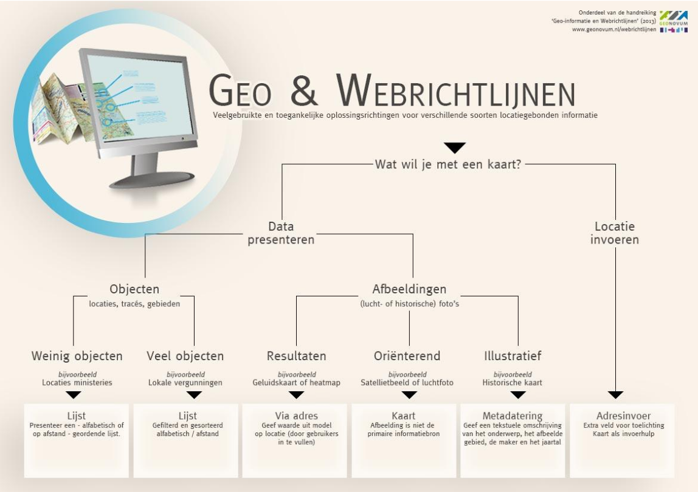

## Handvatten

Presentatie van geo-informatie, locatie-invoer en kaartfunctionaliteit

Dit hoofdstuk biedt praktische oplossingsrichtingen om geo-informatie op een toegankelijke
manier in te zetten in de online communicatie en transacties tussen overheden en burgers en het
bedrijfsleven. Door de bijbehorende beslisboom te doorlopen wordt de keuze voor een specifieke
oplossingsrichting gemaakt. De vraaggerichte aanpak die in Hoofdstuk 3 is gepresenteerd vormt
hierbij de belangrijkste invalshoek voor het doorlopen van de beslisboom(In de eerste stap van
de beslisboom stel je vast wie de centrale bron of hoofdrolspeler in de uitwisseling van geo-
informatie is. Wil een organisatie enerzijds geografische informatie online presenteren of moet
een burger of bedrijf een geografische locatie invoeren om een transactie met een organisatie
uit te voeren.

Beslisboom

In paragraaf 4.1 wordt ingegaan op de oplossingsrichtingen om als
organisatie geografische informatie te presenteren. In paragraaf 4.2 staat het invoeren van een geografische
locatie centraal. Ten slotte biedt paragraaf 4.3 een aantal handvatten om een interactieve kaart op een
toegankelijke manier aan te bieden. De paragrafen bevatten verwijzingen naar code voorbeelden. Alle
voorbeelden zijn online te vinden op de [Github pagina van Geonovum met Code voorbeelden Webrichtlijnen en
Geo-informatie, 2014](https://github.com/Geonovum/Webrichtlijnen-Geo).

### Geo-informatie presenteren
Nadat is vastgesteld, dat de organisatie, die geografische informatie online wil presenteren de hoofdrolspeler
is, is het van belang om de aard van geografische informatie te bepalen. Wat wil je presenteren?

In paragraaf 4.1.1 worden toegankelijke oplossingsrichtingen geboden voor afbeeldingen zoals luchtfoto's,
(historische) topografische kaarten, maar ook voor resultaten van modelanalyses zoals
geluidscontourkaarten. Naast statische afbeeldingen worden ook animaties gebruikt om ontwikkelingen over
ruimte en tijd te kunnen weergeven. In paragraaf 4.1.2 staan animaties centraal. In paragraaf 4.1.3 worden
toegankelijke oplossingsrichtingen geboden voor het presenteren van (een verzameling van) individuele
geografische objecten zoals locaties, trajecten, routes, regio's en gebieden.

#### Statische afbeeldingen
##### Kaarten ter illustratie

Sommige geo-informatie is alleen als een afbeelding beschikbaar en bevat het de primaire informatielaag.
Een voorbeeld is een gedigitaliseerde, (ingescande) [historische kaart](http://kaart.nijmegen.nl/historie/) ( (Historische Atlas Nijmegen, 2014).
In dat geval moet u een toegankelijk alternatief aanbieden. Maar het is ondoenlijk om de volledige inhoud
van zo’n kaart in een tekstvorm te gieten.

**Aanpak**
* Beschrijf het gebied dat is afgebeeld, wie de maker is en wanneer de kaart is gepubliceerd.
* Beschrijf de algemene boodschap of het ruimtelijke patroon van de kaart.
* Let op toegankelijke kaartnavigatie (paragraaf 4.3.1).
* (Let op toegankelijke cartografie (paragraaf 4.3.2).

Achtergrond ter oriëntatie

De [Nationale Atlas Volksgezondheid](http://www.zorgatlas.nl/gezondheid-en-ziekte/ziekten-en-aandoeningen/infectieziekten/mazelen-2013/) past deze aanpak toe (Mazelen 2013-2014, 2014). De beschrijving
naast de kaart vertelt de boodschap die in kaart geografisch wordt gepresenteerd.

##### Wegenkaart, luchtfoto's en satellietbeelden: achtergrond ter oriëntatie
Interactieve kaartviewers gebruiken vaak een wegenkaart, luchtfoto of satellietbeeld als een van de
achtergronden waarop bezoekers allerlei locaties kunnen zien en aanklikken. De wegenkaart, luchtfoto of
satellietbeeld is _niet de primaire informatielaag_, maar fungeert slechts ter oriëntatie.

**Aanpak**

* Presenteer de locaties die bovenop de afbeeldingen zijn gepositioneerd wel op een toegankelijke manier (paragraaf 4.1.2).
* Let op toegankelijke kaartnavigatie (paragraaf 4.3.1).
* Let op toegankelijke cartografie (paragraaf 4.3.2). Hoewel de wegenkaart, luchtfoto of satellietbeeld niet de primaire informatielaag is, kan het de informatieoverdracht vergemakkelijken.

Achtergrond ter oriëntatie

##### Metingen en modelresultaten

Sommige afbeeldingen bevatten onderliggende informatie die bijvoorbeeld door verschillende kleurcodes
worden gevisualiseerd. Voorbeelden van dergelijke kaarten zijn fijnstofconcentratie kaarten,
geluidscontourkaarten, weerkaarten, de Indicatieve Kaart Archeologische Waarden of het Actueel
Hoogtebestand Nederland. Iedere plek in zo'n afbeelding bevat een waarde van een meting of een
modelanalyse.

**Aanpak**
* Presenteer een webformulier, waar bezoekers een adres (van hun woning of bedrijfslocatie) kunnen invullen (paragraaf 4.2) en vervolgens de informatie op dat punt terugkrijgen.

Websites als weeronline.nl (Weeronline, 2014) en buienradar.nl (Buienradar, 2014) geven bijvoorbeeld niet
alleen een neerslagradar, maar ook een tekstuele indicatie of er neerslag gaat vallen op een bepaalde plaats,
wanneer ongeveer en hoeveel.

#### Animaties
Animaties zijn een krachtige en aantrekkelijke manier om veranderingen in ruimtelijke patronen te laten
zien. Dat geldt ook voor animaties met locatiegebonden gegevens. De televisieserie [Nederland van boven](http://www.vpro.nl/nederland-van-boven/alle-datavisualisaties.html)
(datavisualisaties Nederland van Boven, 2014) maakt bijvoorbeeld veel gebruik van animaties om bepaalde
verschijnselen inzichtelijk te maken. Vaak gaat het bij animaties om visualisatie van grote hoeveelheden
gegevens.

**Aanpak**

* Beschrijf de algemene boodschap of het ruimtelijke patroon van de kaart en de ontwikkeling door de tijd of een audiodescriptie. Hierover vindt u meer informatie in de webrichtlijnen (Webrichtlijnen versie 2 - alternatief voor op tijd gebaseerde media, 2014).
* Houd rekening met de richtlijnen voor genoeg tijd (paragraaf 2.3.2)
* Houd rekening met de richtlijnen voor het voorkomen van toevallen (paragraaf 2.3.3).

Een nadeel is dat u zo’n alternatieve beschrijving van tevoren moet meegeven. Dat is niet altijd mogelijk,
bijvoorbeeld als de gebruiker de animatie zelf op maat maakt (door eerst in te zoomen op een kaart en
daarna een animatie te genereren). Maar vaak is de onderliggende informatie wel beschikbaar; de animatie
wordt daar namelijk mee gemaakt. U kunt die onderliggende informatie dan ook tekstueel tonen. Bezoekers
kunnen bijvoorbeeld de bevolkingsontwikkeling per gemeente in Nederland per jaar als kaartanimatie
raadplegen. Presenteer bovendien een lijst met de gemeenten met een filter op jaar. Orden de gemeenten
alfabetisch. Bezoekers kunnen bovendien het eindjaar selecteren om zo de bevolkingsontwikkeling tussen
nu en het eindjaar te zien.

#### Objecten
Veel organisaties willen locaties die een vestigingsadres hebben online presenteren, zoals bijvoorbeeld de
vestigingen van de openbare bibliotheken, de wijkkantoren van de gemeente of tijdelijke wegopbrekingen.
Bedenk, dat bezoekers meestal niet geïnteresseerd zijn in de wegopbrekingen zelf, maar in een alternatieve
route, die de wegopbrekingen omzeilt!

Voorbeelden:

* Overzicht locaties ministeries via HTML en CSS:
  * [Code voor tonen locaties via HTML en CSS](https://github.com/Geonovum/Webrichtlijnen-Geo/tree/master/overzichtministeries-CSS) (Overzichtministeries-CSS, 2014)
  * [Werkend voorbeeld voor tonen locaties via HTML en CSS](https://rawgit.com/Geonovum/Webrichtlijnen-Geo/master/overzichtministeries-CSS/index.html) (Overzicht ministeries, 2014)
* Overzicht locaties ministeries via HTML lijst, data attributen en interactieve kaart:
  * [Code voor tonen locaties via HTML lijst, data attributen](https://github.com/Geonovum/Webrichtlijnen-Geo/tree/master/overzichtministeries-HTMAPL) (Overzichtministeries-HTMAPL, 2014)
  * [Werkend voorbeeld voor tonen locaties via HTML lijst, data attributen](https://rawgit.com/Geonovum/Webrichtlijnen-Geo/master/overzichtministeries-HTMAPL/index.html) (Overzicht ministeries (met HTMAPL), 2014)
* Openbare toiletten:
  * [Code voor tonen locaties uit gegevensbestand op een lijst en op een interactieve kaart via Javascript](https://github.com/Geonovum/Webrichtlijnen-Geo/blob/master/openbaretoiletten/toiletten.html) (Openbaretoiletten - toiletten.html, 2014)
  * [Werkend voorbeeld voor tonen locaties uit gegevensbestand op een lijst en op een interactieve kaart via Javascript](https://rawgit.com/Geonovum/Webrichtlijnen-Geo/master/openbaretoiletten/toiletten.html) (Voorbeeld Openbare toiletten Nijmegen - toegankelijke informatie en kaart, 2014)

Ontwikkelingen in de infrastructuur, de bereikbaarheid en doorstroming zijn thema's die zich door hun vaak
tijdelijke karakter voor lenen om online over te communiceren. Denk hierbij aan strooiroutes, de route van
de intocht van Sinterklaas, of de Staande Mastroute voor zeilen van Vlissingen tot Delfzijl. Bedenk, dat
bezoekers meestal niet zozeer geïnteresseerd zijn in de daadwerkelijke route van de strooiwagens bij
gladheid, maar in een route die zoveel mogelijk gebruik maakt van gestrooide wegvakken.

* Voorbeeld: Carnavalsoptocht uit een GeoJSON bestand
  * [Code voor route](https://github.com/Geonovum/Webrichtlijnen-Geo/tree/master/carnavalsoptocht) (carnavalsoptocht, 2014)
  * [Werkend voorbeeld voor route](https://rawgit.com/Geonovum/Webrichtlijnen-Geo/master/carnavalsoptocht/index.html) (Carnavalsoptocht, 2014)
