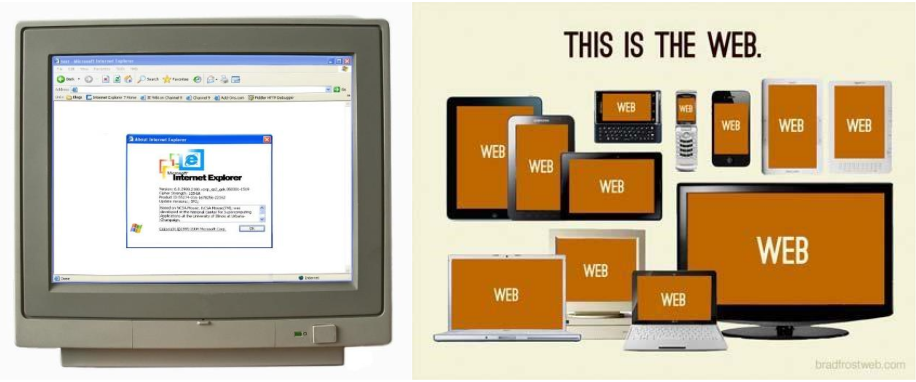

## Wat zijn toegankelijkheidseisen?
In dit hoofdstuk wordt kort ingegaan op het huidige web, de wereld van webrichtlijnen en de
relevantie voor geo-informatie.

### Modern landschap van gebruik
Met mobiele telefoons, tablets, notebooks, laptops, desktops en tv’s kan iedereen overal en altijd online
informatie opzoeken. Op elk apparaat is de grootte en verhouding van het display weer anders, ze worden
allemaal anders bediend en hebben allemaal andere software (browser én besturingssysteem). Zeker van
browsers worden regelmatig nieuwe versies uitgebracht.

Daarnaast staat de ontwikkeling van webstandaarden niet stil. De webstandaarden HTML en CSS
bijvoorbeeld nemen steeds meer technieken over die eerst alleen mogelijk waren met Javascript en Flash.
De verschillende browsers ondersteunen deze standaarden steeds beter. Daardoor is het mogelijk om met
alleen de basis webstandaarden websites te maken die erg rijk zijn aan functionaliteit.

### Webrichtlijnen
Voor alle digitale dienstverlening en informatieverstrekking hebben (semi-)overheden zich gecommitteerd
aan de webrichtlijnen. De webrichtlijnen garanderen de beschikbaarheid van digitale informatie voor iedere
gebruiker. Ze zijn gebaseerd op internationale open standaarden.

De webrichtlijnen zijn een set regels voor het ontwerp, de bouw en het beheer van alle digitale
dienstverlening en informatieverstrekking. Zij zijn een kwaliteitsinstrument: zij zorgen voor (een deel van)
de kwaliteit van een web toepassing, namelijk de toegankelijkheid. Door te voldoen aan de webrichtlijnen is
de informatie voor iedereen - onafhankelijk van het soort apparaat waarmee de site bekeken wordt -
beschikbaar.

De huidige webrichtlijnen (versie 2) bestaan uit twee onderdelen:
1. _De Web Content Accessibility Guidelines 2.0_ (kortweg WCAG 2.0): de internationale toegankelijkheidsrichtlijnen van het World Wide Web Consortium (W3C) uit 2008. Deze bestaan uit 4 principes: Waarneembaar, Bedienbaar, Begrijpelijk en Robuust.

TODO: schrap universeel
1. Aan die 4 principes heeft de Nederlandse overheid een vijfde principe toegevoegd: het principe Universeel. Dit principe ondersteunt de WCAG 2.0-standaard op het gebied van bouwkwaliteit, gebruiksvriendelijkheid en vindbaarheid. Het is opgesteld door de Nederlandse overheid, en is alleen in Nederland van kracht.

TODO: 4?
De 5 principes bevatten samen 22 richtlijnen, die weer zijn onderverdeeld in succescriteria. Meer informatie
over de webrichtlijnen vindt u op [de website drempelvrij](http://www.drempelvrij.nl/waarmerk-2/wcag-20/over-wcag-20) (Over WCAG 2.0 / Webrichtlijnen 2, 2014).

#### Webrichtlijnen versie 1 en 2
Versie 1 van de webrichtlijnen is opgesteld in 2004. Deze versie is uitgegroeid tot de kwaliteitsnorm voor
Nederlandse overheidswebsites. In 2011 is versie 2 gepubliceerd, als gevolg van wijzigingen in de
internationale richtlijnen voor toegankelijkheid van websites (van WCAG 1.0 naar WCAG 2.0). Op 1 januari
2015 vervalt versie 1 van de webrichtlijnen. Tot die datum bestaan versie 1 en versie 2 naast elkaar.

Als overheidsorganisatie bepaalt u zelf welke versie u gebruikt. Gaat uw organisatie voor het eerst met de
webrichtlijnen aan de slag? Kies dan voor versie 2. Gebruikt uw organisatie al versie 1? Dan kan het soms
praktischer zijn om de overstap naar versie 2 nu nog niet te maken.

#### Waarmerk drempelvrij.nl
Het [Waarmerk drempelvrij.nl](http://www.drempelvrij.nl/) (Waarmerk drempelvrij.nl, 2014) van de gelijknamige stichting is bedoeld voor
iedereen die zijn website aantoonbaar toegankelijk wil maken. Het waarmerk mag alleen worden gevoerd
na onderzoek door een onafhankelijke en deskundige inspectie-instelling. De waarmerkregeling kent drie
niveaus, die herkenbaar zijn aan een logo met één, twee of drie sterren. Voor de (semi-)overheid is het
derde niveau verplicht: het niveau van de webrichtlijnen. Krijgt een website drie sterren? Dan is die website
optimaal toegankelijk. Bovendien voldoet de website dan aan extra eisen op het gebied van kwaliteit en
gebruiksvriendelijkheid.

#### Het pas-toe-of-leg-uit-principe
De webrichtlijnen zijn geplaatst op de lijst met open standaarden van de overheid waarvoor het zogenoemde
pas-toe-of-leg-uit-principe geldt. Overheidsorganisaties zijn verplicht om de standaarden op deze lijst toe
te passen ('pas toe'). Is dit om zwaarwegende redenen niet (volledig) mogelijk, dan moeten zij dit op
transparante wijze verantwoorden ('leg uit'). Slechts bij zogenaamde 'redenen van bijzonder gewicht' kan
worden afgeweken. Deze redenen kunnen zijn gelegen in onvoldoende aanbod, onvoldoende veiligheid of
onvoldoende zekerheid bij het functioneren. In dat geval dienen overheden nota bene in hun jaarverslag de
verantwoording voor het niet voldoen aan de webrichtlijnen vast te leggen. Dit ontslaat overheden niet van
de plicht om alsnog aan de webrichtlijnen te voldoen. In het jaarverslag moet namelijk worden opgenomen
welke maatregelen zijn of worden genomen om alsnog aan de webrichtlijnen te kunnen voldoen. Bovendien
moet worden vastgelegd op welke termijn de maatregelen zullen zijn geïmplementeerd.

### Locatiegebonden gegevens: gemeengoed
Locatiegebonden gegevens van overheden komen steeds meer beschikbaar op het web. Geo-informatie
wordt vaak in kaartvorm gepresenteerd. In de digitale dienstverlening en informatieverstrekking van
overheden heeft de digitale kaart meerwaarde. Een goede kaart is herkenbaar en kan veel informatie
overzichtelijk en in haar ruimtelijke context tonen. De interactieve functionaliteit houdt de aandacht van
gebruikers vast en nodigt uit tot meer, want kaarten zijn – voor veel mensen – een intuïtieve manier van
informatieverwerking.

> In 2012 was: “Maps” de meest gebruikte applicatie op de iPhone. Op Android-toestellen was: “Google Maps” de meest gebruikte applicatie na “Google Search”, “Gmail” en “Facebook”.
>
> [Nielsen Tops of 2020](http://www.nielsen.com/us/en/insights/news/2012/nielsen-tops-of-2012-digital.html)
